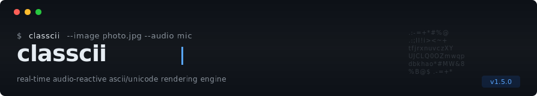

<picture>
  <source media="(prefers-color-scheme: dark)" srcset="assets/banner-dark.svg">
  <source media="(prefers-color-scheme: light)" srcset="assets/banner-light.svg">
  
</picture>

Real-time audio-reactive ASCII/Unicode rendering engine for terminal — with offline generative batch export to mathematically lossless RGB MP4.

[](https://www.rust-lang.org/)
[](LICENSE)
[](https://doc.rust-lang.org/edition-guide/)
[](#quality-assurance)
[](#quality-assurance)
[](https://github.com/FeelTheFonk/classcii/releases)

---

https://github.com/user-attachments/assets/7bd9091a-01ea-4cdf-a842-218c25aa388b

---

## Features

- **6 render modes** -- Ascii, HalfBlock, Braille, Quadrant, Sextant (U+1FB00), Octant (U+1CD00)
- **21 audio sources, 19 targets** -- frequency bands, spectral descriptors, beat detection, MFCC timbral analysis
- **4-stem separation** -- SCNet (drums/bass/other/vocals) with per-stem reactive visualization
- **8 real-time effects** -- fade, glow, chromatic aberration, wave, color pulse, strobe, scan lines, Zalgo
- **Virtual camera** -- zoom, pan, rotation, perspective tilt -- all audio-mappable
- **25 presets** -- from photo-faithful to controlled chaos, including 3 stem-aware presets
- **Batch export** -- headless generative pipeline, energy-classified clip sequencing, lossless `libx264rgb`
- **Workflow save/load** -- full session capture with stem WAVs and binary feature timeline
- **Creation Mode** -- 11 auto-modulation presets adapting effects to audio content
- **Zero unsafe, zero alloc hot loops** -- lock-free triple buffer, `arc-swap`, 100% safe Rust

## Quick Start

```bash
# Standalone exe — works out of the box (25 presets embedded)
classcii --image photo.jpg --audio mic

# Video with audio reactivity
classcii --video clip.mp4

# Cycle presets live
classcii --image photo.jpg --preset 01_pure_photo

# Batch export — generative audio-reactive MP4
classcii --batch-folder ./media/ --audio track.mp3 --preset all
```

## Deployment

The standalone exe works out of the box. 25 presets and default config are embedded in the binary.

| Tier | Contents | External deps | Hot-reload |
|------|----------|---------------|------------|
| **0 -- Standalone** | Exe only | ffmpeg in PATH | No |
| **1 -- Customizable** | Exe + `classcii --init` | ffmpeg in PATH | Yes |
| **2 -- Full Bundle** | Exe + `config/` + `bundle/` | None | Yes |

Set `CLASSCII_HOME` to control the base directory. Run `classcii --init` to extract configs for editing.

## Build from Source

```bash
git clone https://github.com/FeelTheFonk/classcii.git
cd classcii
cargo build --release --features video
```

Requires Rust 1.88+ (Edition 2024), FFmpeg + FFprobe in PATH.

## Documentation

| Document | Content |
|----------|---------|
| [Usage Guide](docs/USAGE.md) | CLI reference, keyboard/mouse controls, configuration, batch export, workflows, troubleshooting |
| [Audio Guide](docs/AUDIO_GUIDE.md) | Audio pipeline, 21 sources, 19 targets, 4 curves, smoothing, stem routing, genre strategies |
| [Reference](docs/REFERENCE.md) | TOML schema, 8 effects, 25 presets, 14 charsets, default values |
| [Changelog](CHANGELOG.md) | Release history |

## Architecture

Three-thread topology + optional stem threads:

| Thread | Role |
|--------|------|
| **Source** | I/O, media decoding (image/GIF/video via ffmpeg subprocess) |
| **Audio** | CPAL capture, FFT (2048 samples), feature extraction, beat detection |
| **Main** | State aggregation, ASCII compositing, ratatui TUI rendering |
| **Stems** | Per-stem cpal playback + independent FFT analysis (when active) |
| **Batch** | Headless mode from pre-analyzed `FeatureTimeline` (offline) |

Lock-free: `triple_buffer` for audio features, `flume` for frames, `arc-swap` for config hot-reload.

### Crate Layout

| Crate | Function |
|-------|----------|
| `af-core` | Shared primitives, config, `FeatureTimeline`, workflow I/O, embedded presets |
| `af-audio` | Audio capture (CPAL), FFT, feature extraction, offline `BatchAnalyzer` |
| `af-ascii` | Luma-to-ASCII, spatial quantization (Braille/Quadrant/Sextant/Octant), dithering |
| `af-render` | Display backend (ratatui), effects pipeline, virtual camera, Zalgo |
| `af-source` | Input stream decoding (image, GIF, FFmpeg, `FolderBatchSource`) |
| `af-export` | Offline rasterizer (`ab_glyph`), alpha-blended Zalgo, lossless MP4 muxer |
| `af-stems` | Stem separation (SCNet subprocess), per-stem playback, analysis, mixing |
| `af-app` | Entry point, CLI (clap), thread orchestration, generative mapper, batch pipeline |

## Quality Assurance

- 165 tests (102 unit/integration + 63 doctests), 3 criterion benchmarks
- `cargo clippy --workspace --features video -- -D warnings` -- 0 warnings
- `cargo fmt --check --all` -- clean
- `#![deny(unsafe_code)]` workspace-wide -- 0 unsafe blocks
- O(1) luminance mapping, validated Sextant/Octant LUTs (zero U+FFFD)
- Hot loops: zero allocation, memory-stable
- All division guarded, all inputs clamped
- Release: LTO=fat, codegen-units=1, strip=symbols, panic=abort

## License

[MIT](LICENSE) OR [Apache-2.0](LICENSE)
